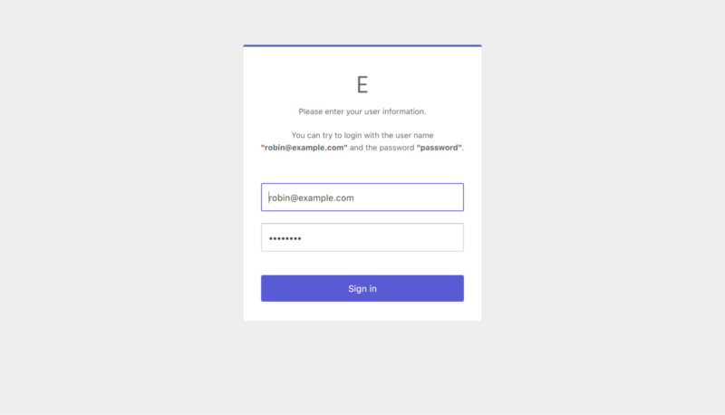
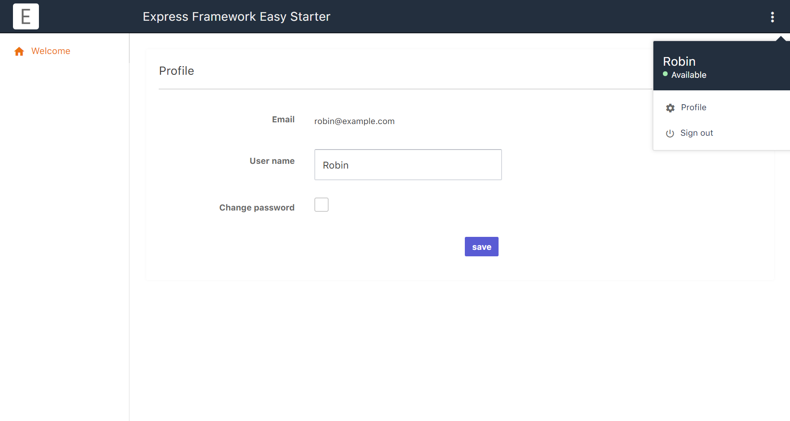

# Node.js - Express Framework Easy Starter

This is a start kit to quickly start the development of Express.

The application uses ES6, the template engine is Handlebars, and the ORM is Sequelize.





<!-- 

 -->
## Change Log

###  0.0.6 (June 7, 2020)

* Added features for user sign-in and sign-out.

* Added information about environment variables (.env) to "Getting Started".

* Fixed a typo in the usage of View.

    File views/index.hbs:

    ```html
    <!-- After: -->
    {{!< default}}
    ...
    {{#contentFor 'pageScripts'}}
    <script src="script.js"></script>
    {{/contentFor}}

    <!-- Before: -->
    {{!< layout}}
    ...
    {{#contentFor 'pageStyles'}}
    <script src="script.js"></script>
    {{/contentFor}}
    ```

###  0.0.5 (June 6, 2020)

* Add face collection page to sample

###  0.0.4 (June 6, 2020)

* It is now possible to define multiple section blocks in a subview that inherits layoutView.

    File views/layout/default.hbs

    ```html
    <!DOCTYPE html>
    <html lang="en">
    <head>
      <meta charset="UTF-8">
      <meta name="viewport" content="width=device-width, initial-scale=1">
      {{{block "pageStyles"}}}
    </head>
    <body>

      {{{body}}}

      {{{block "pageScripts"}}}
    </body>
    </html>
    ```

    File views/index.hbs

    ```html
    {{!< default}}

    {{#contentFor 'pageStyles'}}
    <link rel="stylesheet" type="text/css" href="/style.css">
    {{/contentFor}}

    {{#contentFor 'pageScripts'}}
    <script src="script.js"></script>
    {{/contentFor}}

    <h1>{{title}}</h1>
    ```

* Add Web pack to public

###  0.0.2 (June 6, 2020)

* Changed to automatically map URL and router module.

## Getting Started

1. Install Node.js version 13

    1. Install Node.js version control tool

        ```sh
        npm install -g n;
        ```
    1. Install Node.js version 13

        ```sh
        n 13;
        ```
1. Clone the starter project

    ```sh
    cd /tmp/foo;
    git clone https://github.com/takuya-motoshima/express-easy-starter.git;
    ```

1. Install required packages

    ```sh
    npm install;
    ```

1. Install the latest version of PM2

    ```sh
    npm install -g pm2@latest;
    ```

1. Add the web server settings to "/etc/nginx/conf.d/express-easy-starter.conf" and restart nginx.

    /etc/nginx/conf.d/express-easy-starter.conf:

    ```Nginx
    upstream express-easy-starter-upstream {
      # ip_hash;
      server 127.0.0.1:3001;
      # keepalive 64;
    }

    server {
      listen 80;
      server_name {Your application host name};
      charset UTF-8;
      access_log /var/log/nginx/express-easy-starter.access.log  main;
      error_log /var/log/nginx/express-easy-starter.error.log  warn;

      # Hide PHP version and web server software name
      server_tokens off;
      #more_clear_headers X-Powered-By;
      #more_clear_headers Server;

      # Proxy to nodejs app
      location / {

        #proxy_set_header X-Forwarded-Proto https;
        proxy_set_header X-Forwarded-For $proxy_add_x_forwarded_for;
        proxy_set_header X-Real-IP $remote_addr;
        proxy_set_header Host $http_host;

        # Buffering
        client_max_body_size 100m;
        client_body_buffer_size 100m;
        client_body_temp_path /var/cache/nginx/client_temp;
        proxy_buffers 8 10m;
        proxy_buffer_size 10m;
        proxy_busy_buffers_size 10m;

        # Disable caching
        set $do_not_cache 1;
        proxy_no_cache $do_not_cache;
        proxy_cache_bypass $do_not_cache;
        sendfile off;

        # Enable WebSockets
        proxy_http_version 1.1;
        proxy_set_header Upgrade $http_upgrade;
        proxy_set_header Connection "upgrade";

        # Send a request to an Express application
        proxy_redirect off;
        proxy_read_timeout 1m;
        proxy_connect_timeout 1m;
        proxy_pass http://express-easy-starter-upstream;
      }
    }
    ```

1. Create an environment variable.

    Create "/tmp/foo/.env" and add the following.  
    These can be accessed from the application in a format like "process.env.NODE_ENV".

    ```sh
    NODE_ENV=development
    AWS_REKOGNITION_REGION=ap-northeast-1
    AWS_REKOGNITION_ACCESS_KEY=...
    AWS_REKOGNITION_SECRET_KEY=...
    ```

    |Name|Description|
    |-|-|
    |NODE_ENV|Set "production", "test" or "development".<br>The application connects to the DB of "config/database.js" set here.|
    |AWS_REKOGNITION_REGION<br>AWS_REKOGNITION_ACCESS_KEY<br>AWS_REKOGNITION_SECRET_KEY|Describe the information to access the Amazon Rekognition service used by "shared/RekognitionClient.js".<br>Do not write if your application does not use "shared/RekognitionClient.js".|

1. Start an app

    ```sh
    cd /tmp/foo;
    npm start;
    ```

1. View the website at: https://{Your application host name}

1. Create a table of login accounts

    ```sql

    CREATE DATABASE IF NOT EXISTS `sample` DEFAULT CHARACTER SET utf8mb4;

    USE `sample`;

    CREATE TABLE `user` (
      `id` int(10) unsigned NOT NULL AUTO_INCREMENT,
      `email` varchar(255) NOT NULL,
      `password` varchar(100) NOT NULL,
      `name` varchar(30) NOT NULL,
      `created` datetime NOT NULL DEFAULT current_timestamp(),
      `modified` datetime NOT NULL DEFAULT current_timestamp() ON UPDATE current_timestamp(),
      PRIMARY KEY (`id`),
      UNIQUE KEY `ukAccount1` (`email`)
    ) ENGINE=InnoDB DEFAULT CHARSET=utf8mb4;

    INSERT INTO `user` (`email`, `password`, `name`) VALUES
      ('robin@example.com', 'password', 'Robin'),
      ('taylor@example.com', 'password', 'Taylor'),
      ('vivian@example.com', 'password', 'Vivian'),
      ('harry@example.com', 'password', 'Harry'),
      ('eliza@example.com', 'password', 'Eliza'),
      ('nancy@example.com', 'password', 'Nancy'),
      ('melinda@example.com', 'password', 'Melinda'),
      ('harley@example.com', 'password', 'Harley');
    ```

## Usage

### Features of user sign-in and sign-out

This application uses Passport to authenticate users.

1. To use user authentication, add the following settings to "config/config.js".

    **config/config.js:**

    ```js
    userSignin: {
        enabled: true,
        usernameField: 'email',
        passwordField: 'password',
        successRedirect: '/',
        failureRedirect: '/signin'
    }
    ```

    |Name|Description|
    |-|-|
    |enabled|Set to true to use user authentication.|
    |usernameField|Login ID column name of the user table.|
    |passwordField|Password column name of the user table.|
    |successRedirect|URL of the page to display after signing in|
    |failureRedirect|The URL of the page to display when signing out. This is usually the sign-in page.|

1. Create a sign-in page.

    **routes/signin.js:**

    ```js
    import express from 'express';

    const router = express.Router();
    router.get('/', async (req, res, next) => {
      res.render('signin');
    });
    export default router;
    ```

    **views/signin.hbs:**

    ```html
    <form id="form">
        <p>
            <label>Email:</label>
            <input name="email" type="email"  autocomplete="off" autofocus="autofocus" required>
        </p>
        <p>
            <label>Password:</label>
            <input name="password" type="password" required>
        </p>
        <button type="submit">Sign in</button>
    </form>
    <script>
        document.querySelector('#form').addEventListener('submit', async event => {
          event.preventDefault();
          const formData = new FormData(event.target);
          const data = Object.fromEntries(formData.entries());
          const isSuccess = await (await fetch(`/api/signin`, {
            method: 'POST',
            headers: {
              'X-Requested-With': 'XMLHttpRequest',
              'Content-Type': 'application/json'
            },
            body: JSON.stringify(data)
          })).json();
          if (!isSuccess) return void alert('The email address or password is incorrect.');
          location.href = '/';
        });
    </script>
    ```

1. Create a page for sign-in users and add a sign-out button.

    **routes/index.js:**

    ```js
    import express from 'express';

    const router = express.Router();
    router.get('/', async (req, res, next) => {
      res.render('index');
    });
    export default router;
    ```

    **views/index.hbs:**

    ```html
    <h3>Welcome, {{session.name}}</h3>
    <p><a href="/api/signout">Sign out</a></p>
    ```

1. Add a sign-in action.

    **routes/api/signin.js:**

    ```js
    import express from 'express';
    import UserSignin from '../../shared/UserSignin';

    const router = express.Router();
    router.post('/', async (req, res, next) => {
      const userSignin = new UserSignin();
      const isSuccess  = await userSignin.signin(req, res, next);
      res.json(isSuccess);
    });
    export default router;
    ```

1. Add a sign-out action.

    **routes/api/signout.js:**

    ```js
    import express from 'express';
    import UserSignin from '../../shared/UserSignin';

    const router = express.Router();
    router.get('/', async (req, res, next) => {
      const userSignin = new UserSignin();
      userSignin.signout(req, res, next);
      res.redirect('/');
    });
    export default router;
    ```

1. You can open "https://{application host name}" in your browser to view the sign page.

### URL routing

URL routing is automatic in this application.  
There is a one-to-one relationship between a URL string and its corresponding router module.

For example "routes/users.js" is mapped to "https://{Your application}/users".

Also, "routes/api/users.js" is mapped to "https://{Your application}/api/users".

### Model class

Explains how to connect DB and how to use the model.  
For information on other model methods, see "[Sequelize | Sequelize ORM](https://sequelize.org/)".

* Add the database connection information to "config/database.js".

    ```js
    export default {
      development: {
        username: 'root',
        password: null,
        database: 'sample',
        host: 'localhost',
        dialect: 'mariadb',
        dialectOptions: {
          useUTC: false,
          timezone: 'Etc/GMT-9'
        },
        timezone: 'Etc/GMT-9',
        logging: false
      },
      ...
    ```

* Create a user model in “models/UserModel.js”.

    ```js
    import Model from '../shared/Model';
    import { DataTypes } from 'sequelize';

    export default class extends Model {
      constructor() {
        const table = 'user';
        const attributes = {
          id: {
            type: DataTypes.INTEGER,
            primaryKey: true,
            autoIncrement: true
          },
          email: DataTypes.STRING,
          password: DataTypes.STRING,
          name: DataTypes.STRING,
          created: DataTypes.DATE,
          modified: DataTypes.DATE
        };
        super(table, attributes);
      }
    }
    ```
* Access the table using the user model.

    ```js
    import UserModel from '../models/UserModel';

    // Search user table
    const userModel = new UserModel();
    await userModel.findAll({ raw: true });
    // [
    //   {
    //     "id": 1,
    //     "email": "robin@example.com",
    //     "password": "password",
    //     "name": "Robin",
    //     "created": "2020-06-04T19:26:19.000Z",
    //     "modified": "2020-06-04T19:26:19.000Z"
    //   },
    //   {
    //     "id": 2,
    //     "email": "taylor@example.com",
    //     "password": "password",
    //     "name": "Taylor",
    //     "created": "2020-06-04T19:26:19.000Z",
    //     "modified": "2020-06-04T19:26:19.000Z"
    //   },
    //   ...
    // ]
    ```

### View

* Syntax

    To mark where layout should insert page

    ```html
    {{{body}}}
    ```

    To declare a block placeholder in layout

    ```html
    {{{block "pageScripts"}}}
    ```

    To define block content in a page

    ```html
    {{#contentFor "pageScripts"}}
      CONTENT HERE
    {{/contentFor}}
    ```

* Layouts

    There are three ways to use a layout, listed in precedence order

    Declarative within a page. Use handlebars comment

    ```html
    {{!< default}}
    ```

    File views/layout/default.hbs

    ```html
    <!DOCTYPE html>
    <html lang="en">
    <head>
      <meta charset="UTF-8">
      <meta name="viewport" content="width=device-width, initial-scale=1">
      {{{block "pageStyles"}}}
    </head>
    <body>

      {{{body}}}

      {{{block "pageScripts"}}}
    </body>
    </html>
    ```

    File views/index.hbs

    ```html
    {{!< default}}

    {{#contentFor 'pageStyles'}}
    <link rel="stylesheet" type="text/css" href="/style.css">
    {{/contentFor}}

    {{#contentFor 'pageScripts'}}
    <script src="script.js"></script>
    {{/contentFor}}

    <h1>{{title}}</h1>
    ```

    To run example project

## License

[MIT licensed](./LICENSE.txt)
